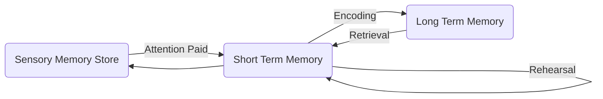

# Multi-store model of memory

- Memory is a cognitive process used to encode, store and retrieve information
- MSM was proposed by **Atkinson and Shiffrin (1968)**
  - Consists of **3 separate components**

| Component of memory           | Description                                                  | Capacity              | Duration    |
| ----------------------------- | ------------------------------------------------------------ | --------------------- | ----------- |
| Sensory memory store          | Detects information and hold it until it is either transferred further into the short-term memory store or lost | Limited by perception | 2-5 seconds |
| Short-term memory store (STM) | Short-term memory is the capacity for holding, but not manipulating, a small amount of information in mind in an active, readily available state for a short period of time. | 5 - 9 chunks          | 30 seconds  |
| Long-term memory store (LTM)  | A place for storing large amounts of information for indefinite periods of time | Extremely large       | Infinite    |

- Sensory information only enters the STM if attention is paid
- Information in the STM enters the LTM only if it rehearsed



### Support for the MSM

- Sperling (1960)
- Glanzer and Cunitz (1966)
  - Participants remembered the first and last items of the list. The recency effect disappears with an interference task.
  - Serial Position effect
    - Is the tendency to recall the first and the last items on a list
  - Serves as support for STM and LTM being separate memory stores.

### Criticisms

- Inability to observe the components of the model 
- Absence of clear psychological basis 
- Focuses on structure rather than process
- Only explains the flow of information in one direction, from sensory memory to the LTM

# Working Memory Model

-  it was discovered that in some cases performing a simultaneous task does not interfere with memory performance

- **Baddeley and Hitch (1974)** developed the working memory model.

-  This model focuses on the structure of STM.

- Consists of **4 Components**

  | Component              | Description                                                  |
  | ---------------------- | ------------------------------------------------------------ |
  | Central Executive      | Is the component that coordinates the 3 subsystems           |
  | Visuospatial Sketchpad | ("The inner eye") hold visual and spatial information.       |
  | Phonological Loop      | Holds sound information and is further subdivided into the phonological store and the articulatory rehearsal component |
  | Episodic Buffer        | integrates information from the other components and also links this information to long-term memory structures |

  ```mermaid
  graph TD
  A(Central Executive) -->B[Phonological Loop]
  B --> A
  A --> C[Visuospatial Sketchpad]
  C --> A
  A --> D[Episodic Buffer]
  D --> A
  
  ```

### Support for the Working memory model

- Conrad and Hull (1964)
  - Demonstrated the phonological similarity effect 
    - In their study participants were required to recall lists of letters. Some lists of letters were phonologically similar while others were not. They found that rhyming lists were more difficult to remember
- Baddeley, Lewis and Vallar (1984)
  - Explored the effects of **articulatory suppression**
    - Articulatory suppression is a method of blocking the "inner voice" (articulatory rehearsal component)

### Evaluation of Working memory model

- More sophisticated than the Multi-store memory model
- Allows us to explain a wider range phenomenon
- Subsequent research has also shown that there are physiological correlates to some of the separate components of the model. For example, distinctly different brain parts “light up” in brain scanning images when the task activates either the phonological loop or the visuospatial sketchpad.
